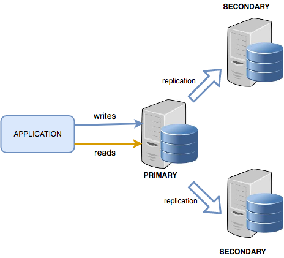

# Configure MongoDB replica sets

This guide provides steps to configure MongoDB replica sets using Ansible for automated deployment. Replica sets ensure high availability and data redundancy by replicating data across multiple MongoDB instances.

## Architecture

<p align="center">
    </img>
</p>

## Requiments

- Ansible installed on the control node.
- A set of MongoDB instances configured on saparate hosts.
- SSH access to MongoDB servers.
- MongoDB installed on all instances.

## Steps

1. **Clone the repo** 

```bash
git clone https://github.com/th1enlm02/Configure-MongoDB-ReplicaSets-using-Ansible.git
cd Configure-MongoDB-ReplicaSets-using-Ansible
```

2. **Update [inventory file](./inventory/mongo.yml) and variables in [.roles/mongodb_repl_set/vars/main.yml](./roles/mongodb_repl_set/vars/main.yml)**

3. **Run the playbook**

```
ansible-playbook -i ./inventory site.yml
```

4. **Verify the Replica Set**

After the playbook runs, log in to any of the MongoDB instances and check the status of the replica set:
```bash
mongosh --eval "rs.status()"
```
